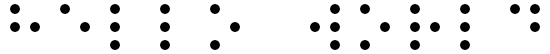
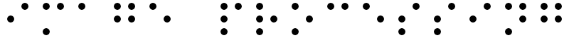

# 🔍 Image-Processing-Braille-Recognition

## 🎯 Main Objective
The goal of this project is to develop a program capable of recognizing and translating Braille text from an input image into an alphabetic writing system. This process involves image processing techniques to identify Braille characters and convert them into readable text.

## 🖼️ Description of Input Images
The input images will be digitally generated Braille text images. These images will be created using a predefined program that maps text characters to their corresponding Braille symbols.

### 📸 Example Input Images

#### 
**Figure 1** - "Hello World" Braille text example.

#### 
**Figure 2** - "Image Processing" Braille text example.

## 🛠️ Steps to Achieve the Objective

### 1️⃣ Image Generation
A program converts text into its Braille representation by mapping each character to its Braille counterpart. These images are then combined to form a complete Braille text image.

### 2️⃣ Preprocessing
To improve image quality and prepare it for segmentation, the following steps are applied:
   - 🏴 **Grayscale Conversion**: Converts RGB images to grayscale to simplify processing.
   - ⚫ **Binarization**: Uses luminance and quantization techniques to convert grayscale images into black and white.
   - 🏗️ **Morphological Closing**: Standardizes Braille dot appearance, making character recognition easier.

### 3️⃣ Image Segmentation
Braille characters are segmented from the processed image to identify individual letters:
   - 🧩 The image is divided into cells corresponding to Braille characters.
   - 🔍 Each cell is further split into six regions.
   - 📊 Each region is analyzed to determine if a dot is present (binary classification: 0 for no dot, 1 for dot).

### 4️⃣ Character Recognition
Each segmented Braille character is compared against a pre-built dictionary containing Braille-to-text mappings. The recognized characters are assembled into a string representing the translated text.

## 📈 Initial Results
Below are some images before and after preprocessing.

#### 
**Figure 4** - "Hello World" before and after preprocessing.

#### 
**Figure 5** - "Colorized" before and after preprocessing.

#### 
**Figure 6** - "My Precious" before and after preprocessing.

## 🎯 Final Results

### ❌ Failure Case
Braille text generated using an external font resulted in inaccurate segmentation due to inconsistent spacing.

#### 
**Figure 7** - Incorrect segmentation due to inconsistent spacing in external fonts.

### ✅ Success Case
When using a standardized font for generating Braille images, the program successfully recognized and translated the text.

#### 
**Figure 8** - Input Braille text for "vem vacina".

#### 
**Figure 9** - Correctly translated result of "vem vacina".

## 🏆 Conclusion
This project successfully demonstrates an image processing pipeline for recognizing Braille text from images. Future improvements could include enhancing segmentation algorithms, supporting handwritten Braille recognition, and incorporating machine learning techniques for more robust character recognition.

## Presentation
[Click here](https://www.canva.com/design/DAGV6Q4gyoo/NHYvsoGyEHGi3ASS39U_LA/edit?continue_in_browser=true) to view the project presentation.
